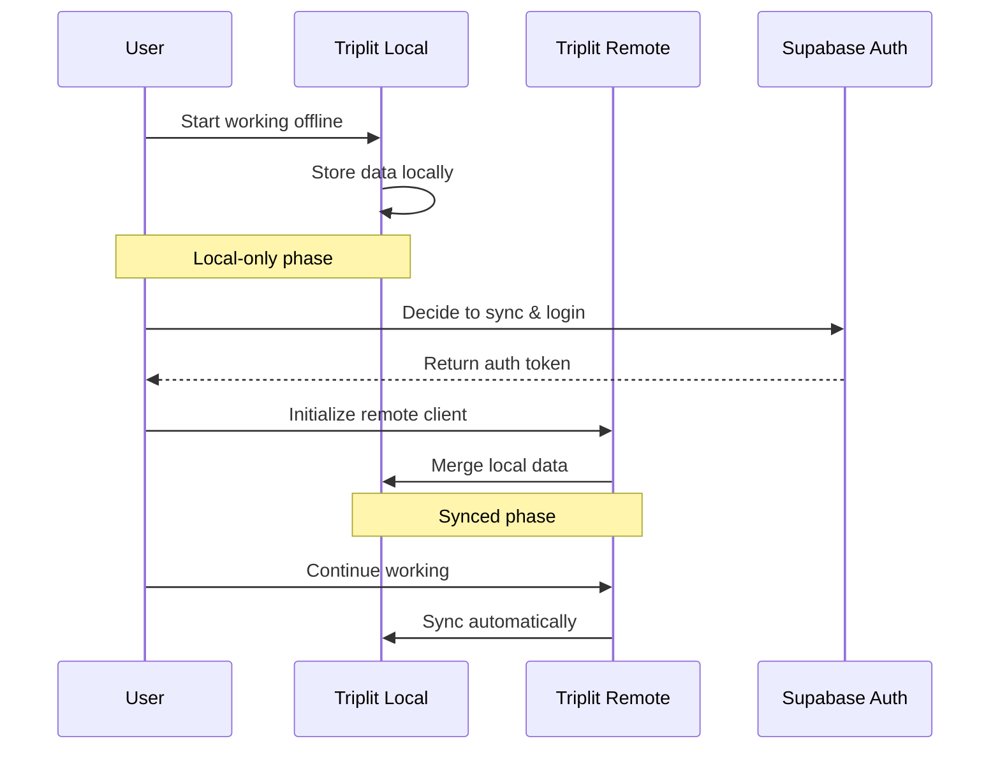

# Offline-First with Supabase and Triplit
_8 min read_

A practical guide to building offline-first applications that sync when ready.
#webdev #angular #typescript #tutorial

## Contents
- [Architecture Flow](#architecture-flow)
- [The Challenge](#the-challenge)
- [The Use Case](#the-use-case)
- [The Schema](#the-schema)
- [The Solution](#the-solution)
- [Implementation Notes](#implementation-notes)
- [Troubleshooting](#troubleshooting)
- [Behind the Solution](#behind-the-solution)
- [Key Takeaway](#key-takeaway)
- [What's Next](#whats-next)
- [Related Resources](#related-resources)
- [Try It Yourself](#try-it-yourself)

## Prerequisites
- Basic knowledge of Angular
- Node.js (latest LTS version)
- Angular CLI (`npm install -g @angular/cli`)
- A code editor (VS Code recommended)

## Architecture Flow



## The Challenge
Building an audio guide creation platform with a unique requirement: users should be able to start working immediately offline, then optionally sync across devices later. This meant combining Supabase's authentication with Triplit's offline-first capabilities in a way that wasn't previously documented.

## The Use Case
We're building an Angular PWA for creating location-based audio guides - think city walking tours, historical districts, nature trails, or architectural explorations. Tour creators need a flexible workflow that matches their real-world process:

1. **Start Immediately**: Guide authors begin crafting their tours on desktop, adding descriptions and planning points of interest, with all data stored locally
2. **Field Work**: Authors take their work to the actual locations using mobile devices to capture GPS coordinates and record audio
3. **Sync When Ready**: Only when ready to collaborate or deploy do they create an account to sync across devices
4. **Continue Seamlessly**: Work continues with automatic syncing when online, allowing final edits and publishing

This removes the friction of mandatory sign-up and matches how tour creators actually work: starting with planning at their desk, then moving to on-site content creation, and finally to publication.

## The Schema
The key to enabling ownership transition is in the schema design, which ensures complete data isolation per user once synced to the cloud:

```typescript
export const schema = S.Collections({
  projets: {
    schema: S.Schema({
      id: S.Id(),
      owner_id: S.String({ nullable: false }),
      // ... other fields
    }),
    rules: {
      read: 'auth.id = owner_id',  // Only owner can read their data
      write: 'auth.id = owner_id'  // Only owner can modify their data
    }
  },
  pois: {
    schema: S.Schema({
      id: S.Id(),
      project_id: S.String({ nullable: false }),
      owner_id: S.String({ nullable: false }),
      // ... other fields
    }),
    rules: {
      read: 'auth.id = owner_id',
      write: 'auth.id = owner_id'
    }
  }
});
```

This design is crucial because:
- Initially, `owner_id` is null during local-only mode
- Once synced, the `owner_id` field and security rules create a complete data isolation boundary
- Each user can only access and modify their own data
- Queries automatically filter by `owner_id = user.id`, ensuring data privacy:

```typescript
getProjectsQueryForUser(userId: string): Observable<Models['projets'][]> {
  return createQuery(() => ({
    client,
    query: client.query('projets')
      .Where('owner_id', '=', userId)  // Critical: Only fetch user's own data
      .Order('created_at', 'DESC')
  })).results$;
}
```

This ensures that when transitioning from local to cloud storage, each user's data remains completely private and invisible to other users.

## The Solution
The key insight is that Triplit can transition from local-only to cloud-synced operation through three critical functions:

### 1. Start Local-Only
Initialize Triplit without a server URL for pure local operation:

```typescript
createLocalClient(): TriplitClient<typeof schema> {
  const client = new TriplitClient<typeof schema>({
    storage: 'indexeddb',
    schema,
    serverUrl: undefined,  // Key: No remote connection
  });
  return client;
}
```

### 2. Clean Up Before Transition
Before switching to remote mode, it's critical to clean up all existing subscriptions and event handlers:

```typescript
async syncLocalProjects() {
  // Clean up existing subscription
  if (this.currentSubscription) {
    this.currentSubscription.unsubscribe();
  }

  // Clean up connection status listeners
  if (this.localConnectionStatusCleanup) {
    this.localConnectionStatusCleanup();
  }

  // Sync local data
  await this.triplitService.syncToRemote(userId);
  
  // Create new remote client
  const client = this.triplitService.createRemoteClient(token);
  
  // Set up new subscriptions with remote client
  this.queryResults = this.triplitService.getProjectsQueryForUser(userId);
  this.currentSubscription = this.queryResults.subscribe(/*...*/);
}
```

This cleanup is essential because:
- Old subscriptions would continue to use the local client
- Event handlers might fire for both local and remote clients
- Query results need to be re-established with the remote client to enforce ownership rules
- Memory leaks are prevented by proper cleanup

### 3. Switch to Remote Mode
Create a new Triplit instance with cloud connectivity:

```typescript
createRemoteClient(token: string): TriplitClient<typeof schema> {
  const client = new TriplitClient<typeof schema>({
    storage: 'indexeddb',  // Same local storage
    schema,
    serverUrl: environment.triplitServerUrl,  // Now with remote URL
    token,  // And authentication
  });
  return client;
}
```

## Implementation Notes
- Triplit maintains the same IndexedDB storage throughout the transition
- The remote client automatically handles merging local and remote states
- Security rules only activate once in remote mode
- Supabase handles just-in-time authentication when users are ready to sync
- **Note:** Query callbacks are triggered multiple times during sync transitions. This is expected behavior and can be managed using RxJS operators like `distinctUntilChanged()`

### Critical Setup: JWT Configuration
For the authentication flow to work, you must configure Triplit to validate Supabase's JWT tokens:

1. Get your Supabase JWT secret:
   - Go to your Supabase project dashboard
   - Navigate to Project Settings > API
   - Copy the JWT Secret (starts with "super-secret-jwt-token-...")

2. Configure Triplit:
   - Go to your Triplit project dashboard
   - Navigate to Authentication > JWT Configuration
   - Paste your Supabase JWT secret
   - Set the JWT Issuer to "supabase"

Without this configuration, the `loginWithToken()` call will fail when attempting to sync local data to the cloud.

## Troubleshooting Common Issues

### Supabase Auth Version
You might encounter warnings related to Supabase's auth client (GoTrue). This is a known issue that remains unfixed. As a temporary workaround, add the following override in your `package.json`:

```json
"overrides": {
  "@supabase/supabase-js": {
    "@supabase/auth-js": "2.61.0"
  }
}
```

### Connection Issues
If you're having trouble with the initial sync:
1. Ensure you're online when attempting to sync
2. Check browser console for detailed error messages
3. Verify your authentication token is valid

## Behind the Solution
This implementation emerged through AI collaboration: Gemini analyzed Triplit's source code to discover the transition possibility, while Augment Code (Claude) implemented the solution. Human input focused on defining the user experience and architectural direction.

## Key Takeaway
This pattern can be adapted for any application where users need to start working immediately offline but may want cloud sync later. The solution provides a frictionless experience while maintaining data integrity throughout the local-to-cloud transition.

## What's Next?
- Add real-time collaboration features
- Implement conflict resolution strategies
- Add offline audio recording capabilities
- Build a mobile companion app

## Related Resources
- [Triplit Documentation](https://triplit.dev)
- [Supabase Auth Guide](https://supabase.com/docs/guides/auth)
- [Angular PWA Tutorial](https://angular.io/guide/service-worker-getting-started)

## About the Author
Software engineer passionate about offline-first architectures and progressive web apps. Currently building tools to make web apps more resilient and user-friendly. Find more of my work on GitHub.

## Try It Yourself
- Live Demo: https://triplit-supabase-demo.vercel.app
- Source Code: https://github.com/triplit/triplit-supabase-demo

---

Thanks for reading! If you found this article helpful:
- ⭐ Star the repository on GitHub
- 🔄 Follow me for more offline-first patterns
- 💬 Share your offline-first experiences in the comments
- 🐛 Found an issue? Open a GitHub issue

For questions or feedback, you can find me on GitHub or reach out through the repository issues.


