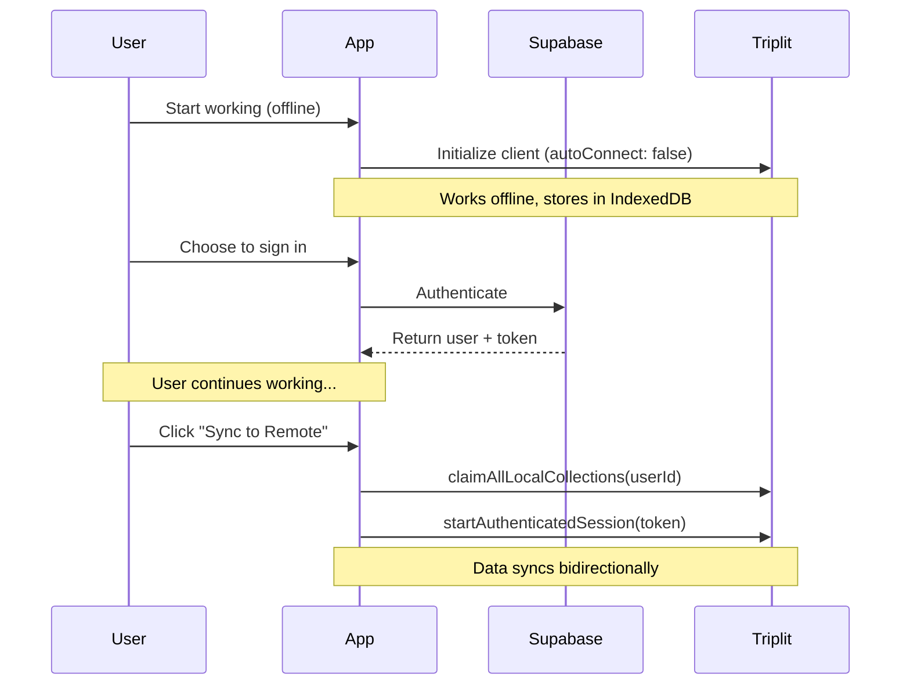

# Offline-First with Supabase and Triplit
_8 min read_

A practical guide to building offline-first applications that sync when ready.
#webdev #angular #typescript #tutorial

## Prerequisites
- Basic knowledge of Angular
- Node.js
- Angular CLI
- A code editor (VS Code recommended)
- A Supabase project
- A Triplit project

## Architecture Flow
[Replace with new mermaid diagram]



## The Challenge
Building an audio guide creation platform with a unique requirement: users should be able to start working immediately offline, then optionally sync across devices later. This meant combining Supabase's authentication with Triplit's offline-first capabilities in a way that wasn't previously documented.

## The Use Case
We're building an Angular PWA for creating location-based audio guides - think city walking tours, historical districts, nature trails, or architectural explorations. Tour creators need a flexible workflow that matches their real-world process:

1. **Start Immediately**: Guide authors begin crafting their tours on desktop, adding descriptions and planning points of interest, with all data stored locally
2. **Field Work**: Authors take their work to the actual locations using mobile devices to capture GPS coordinates and record audio
3. **Sync When Ready**: Only when ready to collaborate or deploy do they create an account to sync across devices
4. **Continue Seamlessly**: Work continues with automatic syncing when online, allowing final edits and publishing

This removes the friction of mandatory sign-up and matches how tour creators actually work: starting with planning at their desk, then moving to on-site content creation, and finally to publication.

This ensures that when transitioning from local to cloud storage, each user's data remains completely private and invisible to other users.

## The Solution
The key insight is using a single Triplit client instance that starts disconnected and can later be authenticated:

### 1. Initialize Triplit Client
```typescript
constructor() {
  this.client = new TriplitClient<typeof schema>({
    storage: 'indexeddb',
    schema,
    serverUrl: environment.triplitServerUrl,
    autoConnect: false,  // Start disconnected
    onSessionError: async (type) => {
      console.warn('Session error:', type);
      await this.handleSessionError();
    },
  });

  this.connectionStatusCleanup = this.setupClientListeners(this.client);
}
```

### 2. Handle Authentication Separately
The login process is handled independently through Supabase:

```typescript
async signIn(email: string, password: string) {
  const { data, error } = await this.supabase.auth.signInWithPassword({
    email,
    password
  });
  if (error) throw error;
  return data;
}
```

### 3. Sync When Ready
Users explicitly choose when to sync their data:

```typescript
async startRemoteSync() {
  const { data: { session } } = await this.supabaseService.getSession();
  if (session?.access_token) {
    await this.triplitService.claimAllLocalCollections(session.user.id);
    await this.triplitService.startAuthenticatedSession(session.access_token);
  }
}
```

## Schema Design
The schema enforces data isolation using role-based permissions:

```typescript
export const schema = S.Collections({
  projects: {
    schema: S.Schema({
      id: S.Id(),
      owner_id: S.String({ nullable: true }),
      shared_with: S.Set(S.String()),
      // ... other fields
    }),
    permissions: {
      read: {
        filter: [
          or([
            ['owner_id', '=', '$role.userId'],
            ['shared_with', 'includes', '$role.userEmail']
          ])
        ]
      },
      insert: {
        filter: [
          or([
            ['owner_id', '=', '$role.userId'],
            ['shared_with', 'includes', '$role.userEmail']
          ])
        ]
      },
      update: {
        filter: [
          or([
            ['owner_id', '=', '$role.userId'],
            ['shared_with', 'includes', '$role.userEmail']
          ])
        ]
      },
      delete: {
        filter: [['owner_id', '=', '$role.userId']]
      }
    }
  }
});
```

## Implementation Notes
- Single client instance maintains consistency throughout the app lifecycle
- Authentication and sync are separate user actions
- Permissions activate automatically when session starts
- Connection status is tracked and displayed to users
- Automatic conflict resolution handled by Triplit

## Troubleshooting Common Issues

### Connection Status
Monitor the connection status to debug sync issues:
```typescript
private setupClientListeners(client: TriplitClient<typeof schema>) {
  client.onConnectionStatusChange((status) => {
    console.log('Connection status:', status);
    this.connectionStatus.set(status);
  });
}
```

### Supabase Auth Version
You might encounter warnings related to Supabase's auth client (GoTrue). This is a known issue that remains unfixed. As a temporary workaround, add the following override in your `package.json`:

```json
"overrides": {
  "@supabase/supabase-js": {
    "@supabase/auth-js": "2.61.0"
  }
}
```

### Connection Issues
If you're having trouble with the initial sync:
1. Ensure you're online when attempting to sync
2. Check browser console for detailed error messages
3. Verify your authentication token is valid

## Behind the Solution
This implementation emerged through AI collaboration: Gemini analyzed Triplit's source code to discover the transition possibility, while Augment Code (Claude) implemented the solution. Human input focused on defining the user experience and architectural direction.

## Key Takeaway
This pattern can be adapted for any application where users need to start working immediately offline but may want cloud sync later. The solution provides a frictionless experience while maintaining data integrity throughout the local-to-cloud transition.

## What's Next?
- Add real-time collaboration features
- Implement conflict resolution strategies
- Add offline audio recording capabilities
- Build a mobile companion app

## Related Resources
- [Triplit Documentation](https://triplit.dev)
- [Supabase Auth Guide](https://supabase.com/docs/guides/auth)
- [Angular PWA Tutorial](https://angular.io/guide/service-worker-getting-started)

## About the Author
Software engineer passionate about offline-first architectures and progressive web apps. Currently building tools to make web apps more resilient and user-friendly. Find more of my work on GitHub.

## Try It Yourself
- Live Demo: https://triplit-supabase-demo.vercel.app
- Source Code: https://github.com/triplit/triplit-supabase-demo

---

Thanks for reading! If you found this article helpful:
- ⭐ Star the repository on GitHub
- 🔄 Follow me for more offline-first patterns
- 💬 Share your offline-first experiences in the comments
- 🐛 Found an issue? Open a GitHub issue

For questions or feedback, you can find me on GitHub or reach out through the repository issues.


